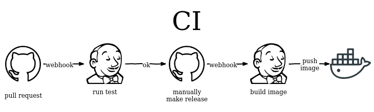
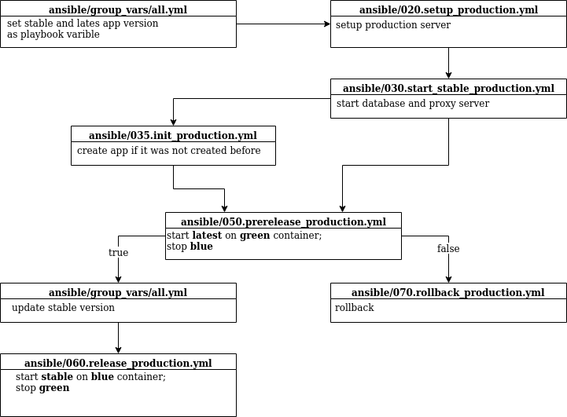

# Final Project

We will use following names for future description:

- **DevOpsProject** - our main project. All our DevOps code will be store there. The url of the project: [https://github.com/elegantsignal/m-sa2-10-19-project](https://github.com/elegantsignal/m-sa2-10-19-project).

- **DevOpsServer** - the server for Jenkins. From this server we manage our CI/CD process.

- **AppProject** - our test project. In this project we simulate development process and it will be used as our CI/CD tasks: [https://github.com/elegantsignal/m-sa2-10-19-app](https://github.com/elegantsignal/m-sa2-10-19-app)

- **AppServer** - the server for our AppProject.

## Overview

**AppProject** is based on **Drupal8**. This project is used for our CI/CD tasks. We use two servers (for Jenkins and for AppProject). To simulate development workflow we use **git branches**. On **pull request** in AppProject Jenkins will run tests. Tests results are shown in pull requests so we are able to make decision based on the tests. If tests are passed we accept pull request and merge commit to the **master** branch. To make **release** we should assign **tag** to the commit in master branch. For each release **Jenkins** build **Docker image** and push it to **DockerHub**. Production deployment is made based on Docker images.

## Create demo project

To create demo project we use `./initproject.sh` script from **DevOpsProject**. This scrip make demo Drupal8 project and push it to GitHub. In fact whole **AppProject** is made by this script.

```bash
git log --oneline --all --graph
```

> ```
> * ea96d3d7 (dev-8.8.0) drupal-8.8.0
> * e452333d (dev-8.7.10) drupal-8.7.10
> * 7b01ee05 (dev-8.7.9) drupal-8.7.9
> * 6a81126a (dev-8.7.8) drupal-8.7.8
> * c00f3fbe (dev-8.7.7) drupal-8.7.7
> * 62494521 (dev-8.7.6) drupal-8.7.6
> * ff08e851 (HEAD -> master) drupal-8.7.5
> ```

**drupal-8.7.5** in **master** branch - our first release. Other branches contains nothing more then next Drupal releases. We will use them to simulate workflow by creating pull requests. We use separate branches instead of one or two development branches to make our simulation more simple and obvious.

## Setup Environment

### Jenkins server

Jenkins run inside Docker container on the **DevOpsServer**. The Docker image and the server are configured to be able to run Ansible and other Docker containers from the Jenkins. For Jenkins environment deployment we use Ansible scripts.

#### Setup host machine environment

Clone **DevOpsProject** then execute:

```bash
pip3 install --user -r requirements.txt
```

#### Setup Jenkins server

1. Edit `ansible/inventory.yml`.

1. Setup Docker and Jenkins on **DevOpsServer** (from `ansible` directory):

   ```bash
   ansible-playbook --vault-password-file pass  010.setup_jenkins.yml
   ```

## CI



We setup GitHub to call webhooks on each pull request for **AppProject**. **Jenkins** handle them and run test on each. `tests/Jenkinsfile` in **DevOpsProject** manage test. The test steps described in `tests/test.sh`.

### Test

1. Clone/update **AppProject** from Github.

1. Run **docker-compose** file which contains:

   1. **drupal**.
      We copy just cloned **AppProject** and `tests/test.sh` inside Docker image during build process.

   1. **postgres**.

1. Run `/test.sh` inside **drupal** container. The script do following steps:

   1. Checkout to **last known release** of **AppProject**.

   1. Create new Drupal site, install some modules and generate dummy content.

   1. Put site to **maintenance mode** and **clear cache**.

   1. Merge **pull request commit** (hash passed as environment variable to the container) into actual app state (latest release).

   1. Do database updates and generate some additional dummy content.

   If script fail on **any** step test will be failed.

Test results will be publish to pull request of **AppProject**.

### Release

On GitHub release event for **AppProject** we trigger webhook which starts Jenkins **release pipeline**. Jenkinsfile for pipeline located in `release/Jenkinsfile`. The pipeline:

1. Clone **AppProject**.

1. Checkout to **tag** from webhook payload.

1. Build Docker image.

1. Publish image to [AppProject registry on DockerHub](https://hub.docker.com/repository/docker/elegantsignal/m-sa2-10-19-app).

## CD



First of all we need to setup **stable** and **latest** version of application in `ansible/group_vars/all.yml`.

1. Playbook will install everything we need on production server.

   ```bash
   ansible-playbook --vault-password-file pass 020.setup_production.yml
   ```

1. Playbook configure and start **Nginx** and **Postgres**.

   ```bash
   ansible-playbook --vault-password-file pass 030.start_stable_production.yml
   ```

1. This playbook should be run only once. It create demo content for the project.

   ```bash
   ansible-playbook --vault-password-file pass 035.init_production.yml
   ```

1. Start **latest** version of application.

   ```bash
   ansible-playbook --vault-password-file pass 050.prerelease_production.yml
   ```

1. If everything is okay with **latest** we can update stable version in `ansible/group_vars/all.yml` and run this playbook to fix changes.

   ```bash
   ansible-playbook --vault-password-file pass 060.release_production.yml
   ```

1. We should run this playbook to make rollback from **latest** to **stable** version.

   ```bash
   ansible-playbook --vault-password-file pass 070.rollback_production.yml
   ```

### Update process

Update process realized in non trivial way: in **docker-compose.yml** (`ansible/roles/app_setup/templates/docker-compose.yml.j2`) configured to be able to run two containers with different version of our application. By default will be run **blue** container named `upstream` with **stable** version. **Nginx** will proxy requests to them by name. When we run **green** container with **latest** version only on thing to switch traffic to them is rename them to `upstream`. It is simple description of update process. Ansible playbook to realize **update** process is more complicated and include such steps as put site to maintenance mode, database backup, etc.

### Release process

Release process is very similar to update. But renaming is made in reverse to update way. 

### Rollback process

Rollback process mean that everything is bad and we should make them as quick as possible. So we kill all app containers, import database dump and start **blue** container. It takes not more them 10s.
